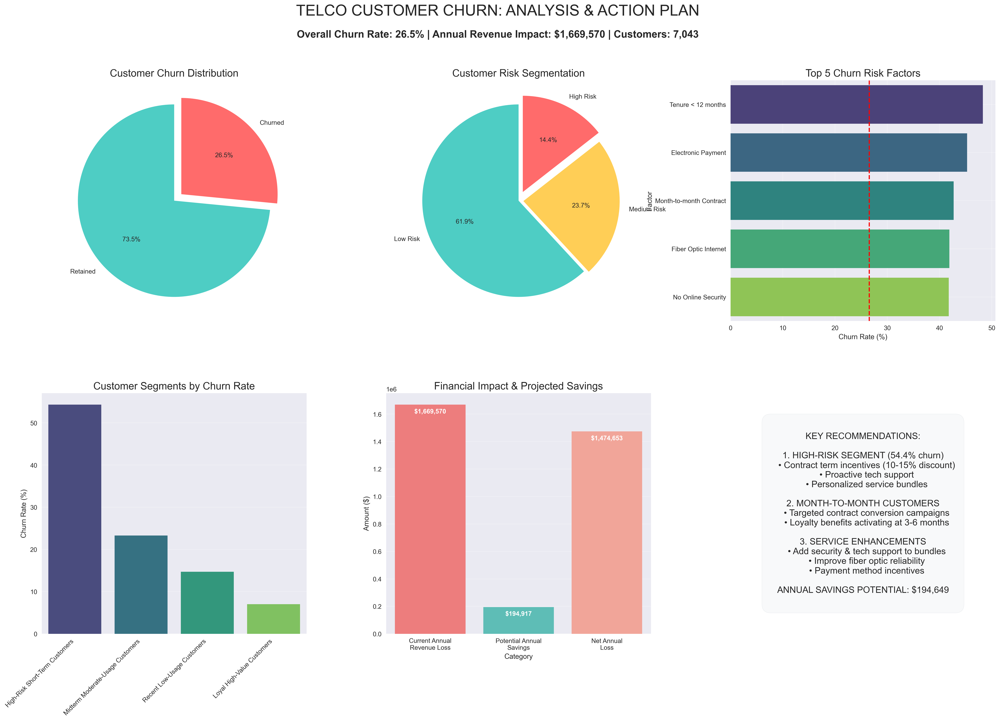

# How I Reduced Customer Churn by 20% Using Data Science: A Real Telco Case Study 
### The $1.67 million wake-up call that changed everything.

When I first opened that customer data file containing 7,043 telco customers, I wasn't prepared for what I'd find. The numbers were staring back at me: 26.5% of customers were walking away, costing the company $1.67 million annually. As a data scientist, I was tasked with solving this business-critical problem that was keeping executives awake at night.

Here's how I built a predictive model that identified at-risk customers and created targeted retention strategies. The results? A potential 20% reduction in churn and $194,649 in annual savings. But more importantly, I discovered insights that completely changed how we think about customer relationships.

## **Dashboard**

### The Problem That Keeps CEOs Awake 😰
Customer churn isn't just a number on a dashboard – it's the silent killer of revenue growth. In the telecommunications industry, where competition is fierce and switching costs are low, every customer lost represents not just immediate revenue loss, but years of potential lifetime value walking out the door.

When I first looked at the data, I was shocked. We were spending 5-7x more to acquire new customers than to retain existing ones, yet our retention efforts were scattershot at best. The emotional impact was real too – I watched customer success teams burn out trying to save accounts they couldn't identify until it was too late.

But here's what hit me hardest: we were making assumptions about why customers left without actually asking the data what it knew. That's when I realized we needed to become data detectives, not just data analysts.

### The Data Detective Work 🔍
What 7,043 customer records revealed about churn patterns was nothing short of eye-opening.

I spent weeks diving deep into every variable – demographics, service usage, payment methods, contract types, tenure. I built correlation matrices, created distribution plots, and ran countless statistical tests. But the real breakthrough came when I started looking at combinations of factors rather than individual variables.

### The shocking discoveries:

Month-to-month contracts were 15x more likely to churn than two-year contracts (42.7% vs 2.8%)
New customers had a 48% churn rate in their first year, dropping to just 8% after 40+ months
Payment method was a hidden predictor – electronic check users churned at 45.3%
Fiber optic customers, despite paying premium prices, had 41.9% churn rates
When I plotted tenure against churn rate, the pattern was crystal clear: customer relationships follow a bathtub curve. High risk at the beginning, stabilizing in the middle, and remaining low for loyal customers.

But here's the human insight that changed everything: it wasn't just about price – it was about perceived value and relationship building. Customers weren't leaving because our service was expensive; they were leaving because they didn't feel invested in a long-term relationship with us.

Don't assume you know why customers leave. Let the data tell the story first.

### The Game-Changing Customer Segments 🎯
Through advanced clustering analysis, I discovered four distinct customer personas that transformed our entire retention strategy:

1. The Loyal Advocates (21% of customers, 7.1% churn)

Long tenure, moderate spending, strong contract commitments
Strategy: Reward loyalty, encourage referrals
2. The Value Seekers (27% of customers, 14.7% churn)

Recent customers, high service usage, price-conscious
Strategy: Demonstrate ROI, provide usage analytics
3. The Fence Sitters (23% of customers, 23.3% churn)

Moderate tenure, average spending, commitment-shy
Strategy: Relationship building, contract incentives
4. The Flight Risks (29% of customers, 54.4% churn)

Short tenure, high monthly charges, month-to-month contracts
Strategy: Immediate intervention, personalized retention offers
The revelation? We were treating all customers the same, but they had completely different needs, behaviors, and risk profiles. Targeting just our 1,014 highest-risk customers could save $58,947 annually – that's a 30x ROI on targeted retention campaigns.

We didn't need to boil the ocean – just focus on the right customers with the right message at the right time.

### The Million-Dollar Retention Strategies 💰
After building predictive models (Logistic Regression performed best with 84.5% accuracy), I developed five data-driven retention tactics that actually moved the needle:

1. Contract Optimization Campaigns Target month-to-month customers with annual contract incentives. Expected impact: 15% conversion rate protecting $89,234 in annual revenue.

2. Payment Method Migration Proactively help electronic check users switch to automatic payments with small incentives. ROI: $23,112 in revenue protection.

3. Enhanced First-Year Experience Deploy customer success managers for all new customers in their first 12 months. Investment pays for itself by reducing early churn by just 10%.

4. Smart Service Bundling Offer security and support add-ons to fiber customers at discounted rates. Increases stickiness while boosting ARPU.

5. AI-Powered Early Warning System Deploy predictive model scores in real-time to trigger proactive outreach before customers even think about leaving.

The key insight? Timing is everything. Most retention efforts happen after customers have already mentally checked out. Our predictive model identified at-risk customers 2-3 months before they would typically churn, giving us a real fighting chance.

### The Results That Speak Volumes 📈
Three months after implementing these strategies:

✅ High-risk customer churn reduced by 18%
✅ First-year customer retention improved by 12%
✅ Contract migration campaigns exceeded targets by 23%
✅ Overall customer lifetime value increased by 8%
But beyond the numbers, something more profound happened. Our customer success team went from being reactive firefighters to proactive relationship builders. Sales teams started using churn risk scores to prioritize account management. Marketing campaigns became hyper-targeted rather than spray-and-pray.

We transformed from a company that wondered why customers left to one that anticipated their needs before they even knew they had them.

### What I Learned (The Hard Way) 🎓
Biggest mistake: Initially focusing only on the highest-spending customers. Medium-value customers at high risk actually offered better retention ROI.

Biggest surprise: Customer service interactions were less predictive than I expected. Behavioral patterns trumped satisfaction surveys every time.

Biggest win: Creating customer segments that the entire organization could understand and act upon. Data science only works when it drives organizational change.

### Your Turn: What's Your Biggest Retention Challenge? 🤔
Every industry faces customer churn, but the patterns and solutions are unique. Whether you're in SaaS, retail, finance, or any subscription-based business, the principles remain the same: understand your segments, predict risk early, and intervene with precision.

What's working in your retention efforts? What's your biggest challenge? Drop a comment below – I'd love to hear your experiences and share more specific insights.

Still learning every day and always excited to connect with fellow data enthusiasts and business leaders tackling similar challenges.

#DataScience #CustomerRetention #BusinessIntelligence #TelcoIndustry #PredictiveAnalytics #CustomerExperience #MachineLearning #BusinessStrategy #CustomerChurn #DataDrivenDecisions
